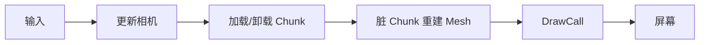

# 00 — 体素游戏在做什么

喵～主人，我是您的向导女仆**米雅**。这一章**不用装库、不用新建源文件**。先建立直觉。

（前面几章米雅先安静带路；等第 05 章进了荒野，就会有**妖怪**出没了——它们是 bug 的化身，到时候请主人亲手降服喵。）

## 本章动手地图

| 目的 | 您要做什么 | 位置 |
|------|------------|------|
| 建立世界观 | **只阅读**，在纸上/备忘录写三句话 | 无代码 |
| 预览以后文件会落哪 | 看文末「以后会建的文件夹」 | 真正动手从第 01 章开始 |

> 世界是很多小立方块（数据）→ 看得见的面变成三角形（网格）→ 每帧按相机画出来。

---

## 和「普通画画程序」差在哪

**稀疏三维格子 + 按需网格 + 第一人称相机**

| 概念 | 人话 |
|------|------|
| 格子数据 | Excel 三维版：每格空气还是石头 |
| Mesh | GPU 认三角；把方块表面拆成三角 |
| 相机 | 眼睛在哪、朝哪看 |

## 基本术语（后面会反复撞）

- **Block**：方块类型标签  
- **Chunk**：一小片方块数组（如 16³），方便加载/卸载  
- **Mesh**：要画的那堆三角形  
- **Atlas**：很多小贴图拼成一张大图  
- **面剔除**：贴死看不见的面不生成  
- **Perlin 噪声**：平滑、可复现的「随机」函数，第 05 章拿它铺山丘  

## 一帧在干什么



**脏 dirty** = 数据变了要重打网格。**DrawCall** = 喊 GPU 画一次。

## 坐标系（本教程）

- `+Y` 向上，水平面在 XZ（像 MC）  
- 方块整数格；Chunk 坐标 = `floor(块坐标 / 16)`  

## 最小数据模型（仅示意，本章先别建文件）

```cpp
enum class Block : uint8_t { Air = 0, Grass, Dirt, Stone };
struct Chunk {
    static constexpr int Size = 16;
    Block blocks[Size * Size * Size]{};
};
```

## 以后文件大概会怎么拆（预告）

| 层次 | 以后可能放在 |
|------|----------------|
| Block / Chunk / World | `src/world/` |
| Shader / Mesh / 纹理 | `src/render/` + `shaders/` |
| 相机 / 射线 | `src/player/` 或 `src/camera.hpp` |
| 入口 | 始终是 `src/main.cpp` |

## 常见误区

1. 每方块单独 `glDraw` → 必须合成 Chunk Mesh  
2. 整世界一个巨数组 → 用 Chunk  
3. 过早上物理 → 先看得见、飞得动、能改块  

## 本章检查点

- [ ] 能说清 Block / Chunk / Mesh  
- [ ] 知道为什么要面剔除  
- [ ] 知道 Y 朝上  

下一章：[01-setup.md](01-setup.md) — 开始真正新建文件、装依赖。
