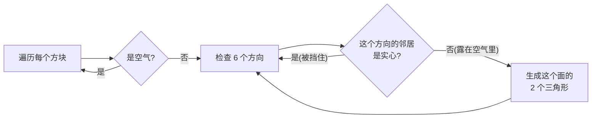

# 04 — Voxel Chunk 与面剔除网格

喵～这一章是整个项目的「心脏」。第 02 章我们手写了 36 个顶点画出一个立方体；现在方块成千上万，**不可能一个个手写**。我们要让程序**自动**把「一大盒方块数据」变成「GPU 能画的三角形」，而且只画看得见的那些面。

主人您说第 3 节那段伪代码看不懂怎么落笔 —— 本章把它**逐行写成真正能编译的 C++**，并且把每个图形学名词都翻成人话。看完您就能自己写出 `rebuildMesh` 了。

## 本章动手地图

| 步骤 | 为了…… | 请您现在做 |
|------|--------|------------|
| A | 定义方块种类 | **新建** `src/world/block.hpp`（enum + `isSolid`） |
| B | 存 16³ 数据 | **新建** `src/world/chunk.hpp`（`get`/`set`/`dirty`） |
| C | 理解「面剔除」在干嘛 | **只阅读**第 2 节，不写代码 |
| D | 自动生成三角形 | 在 `chunk.hpp` 里写完整的 `rebuildMesh()` |
| E | 把三角形交给 GPU | 在 `chunk.hpp` 里写 `upload()` / `draw()`（每个 Chunk 自带 VAO/VBO） |
| F | 画面上看到体积 | **改** `main.cpp`：删掉第 02 章手写立方体，改成画一个 Chunk |

> 本章仍复用第 02 章的 `shaders/basic.vert` / `basic.frag`（顶点 = 位置 + 颜色），先不碰贴图。贴图留到第 06 章。

---

## 1. 为了定义方块：新建 block.hpp

**路径：** `src/world/block.hpp`（先建文件夹 `src/world/`）

```cpp
#pragma once
#include <cstdint>

// 方块类型。用 uint8_t 是因为一个 Chunk 有 4096 个格子，
// 每格只占 1 字节，省内存。
enum class Block : uint8_t {
    Air = 0,   // 空气：看不见、能穿过
    Grass,     // 草方块
    Dirt,      // 泥土
    Stone,     // 石头
};

// 「实心」= 不是空气。面剔除时要反复问这个。
inline bool isSolid(Block b) { return b != Block::Air; }
```

**人话：** `Block` 只是一个「标签」，告诉我们某个格子里装的是什么。它本身**不含任何图形信息**，画不画、怎么画，全由后面的网格代码决定。

---

## 2. 为了不画看不见的面：先搞懂「面剔除」（只阅读）

这一节不写代码，但**必须先理解**，否则第 4 节会一头雾水。

### 一个立方体有 6 个面

想象一个方块，它有：上、下、前、后、左、右 —— 6 个正方形面。每个正方形面，GPU 只认三角形，所以要用 **2 个三角形** 拼成（像把一张正方形便利贴沿对角线剪一刀）。

所以一个**完全孤立**的方块 = 6 面 × 2 三角 × 3 顶点 = **36 个顶点**（这正是第 02 章手写的那 36 个）。

### 为什么不能每个方块都画 36 个顶点？

假设地形是 16×16×16 全是石头 = 4096 个方块。若每个都画 36 顶点 = 约 15 万顶点。但**绝大多数方块被埋在地下，六个面全被邻居挡住，一个像素都看不到**。画它们纯属浪费。

### 面剔除（Face Culling）= 只留「暴露在空气里」的面

规则一句话：

> **一个面，只有当它「朝向的那个邻居」是空气时，才需要画。**

举例：一块石头的上面，如果头顶正上方也是石头 → 这个上面被压在下面，看不见 → **跳过**。如果头顶是空气 → 能看见 → **画出来**。

对 4096 个方块的实心立方体，最后只会留下**表面那一层**朝外的面，顶点数从 15 万暴跌到几千。这就是体素引擎能跑起来的关键。



**记住这张图**，第 4 节的代码就是它的逐字翻译。

---

## 3. 为了存一区块数据：新建 chunk.hpp（先写骨架）

**路径：** `src/world/chunk.hpp`

先写「数据 + 读写」部分，网格部分下一节再补：

```cpp
#pragma once
#include <glad/glad.h>     // 需要 GL 函数（VAO/VBO）
#include <glm/glm.hpp>     // 需要 vec3 存颜色
#include <vector>          // CPU 端顶点先攒在 vector 里
#include "block.hpp"

struct Chunk {
    static constexpr int N = 16;          // 边长：16×16×16 = 4096 格
    Block blocks[N * N * N]{};            // 全部初始化为 Air(0)
    bool dirty = true;                    // true = 数据变了，网格要重建

    // GPU 资源：这个 Chunk 自己的一套 VAO/VBO（第 02 章讲过是什么）
    GLuint vao = 0, vbo = 0;
    int vertexCount = 0;                  // draw 时要知道画几个顶点

    // 三维坐标 (x,y,z) 压成一维下标。
    // 想象 N 张 N×N 的纸摞起来：先跳过 z 张(每张 N*N)，再跳 y 行(每行 N)，最后 +x。
    static int index(int x, int y, int z) { return x + N * (y + N * z); }

    // 读某格。越界当成空气（这样查邻居时不会数组越界）。
    Block get(int x, int y, int z) const {
        if (x < 0 || y < 0 || z < 0 || x >= N || y >= N || z >= N)
            return Block::Air;
        return blocks[index(x, y, z)];
    }

    // 写某格。改了就标脏，下一帧会重建网格。
    void set(int x, int y, int z, Block b) {
        blocks[index(x, y, z)] = b;
        dirty = true;
    }

    void rebuildMesh();  // ← 下一节实现
    void draw();         // ← 下一节实现
};
```

> **为什么每个 Chunk 自带 VAO/VBO？** 第 02 章只有一个立方体，用一套 VAO/VBO 就够。现在每个 Chunk 是一堆**不同的**三角形，各自需要一块显存存自己的顶点。所以把 `vao/vbo` 放进 `struct Chunk` 里，一个 Chunk 一套。

---

## 4. 为了自动生成三角形：写完整的 rebuildMesh

**这就是主人问的「那段伪代码该咋写」。** 我们分三步拆开。

### 4.1 先准备两张「查表」——这是关键技巧

手写立方体最麻烦的是记住每个面 4 个角的坐标。我们把它**存成表**，让循环去查，而不是硬写。

在 `chunk.hpp` 里，`Chunk` 结构体**之前**（文件里、struct 外面）加：

```cpp
// 每个方块占据从 (x,y,z) 到 (x+1,y+1,z+1) 的 1×1×1 空间。
// 下面是 6 个面、每面 4 个角，相对方块原点的 0/1 偏移量。
// 4 个角的顺序是「从外面看逆时针」，这样正面朝外（第 02 章的绕序规则）。
static const float FACE[6][4][3] = {
    // +X 右面
    {{1,0,1},{1,0,0},{1,1,0},{1,1,1}},
    // -X 左面
    {{0,0,0},{0,0,1},{0,1,1},{0,1,0}},
    // +Y 上面
    {{0,1,1},{1,1,1},{1,1,0},{0,1,0}},
    // -Y 下面
    {{0,0,0},{1,0,0},{1,0,1},{0,0,1}},
    // +Z 前面
    {{0,0,1},{1,0,1},{1,1,1},{0,1,1}},
    // -Z 后面
    {{1,0,0},{0,0,0},{0,1,0},{1,1,0}},
};

// 每个面「朝向的邻居」在哪个方向。顺序和 FACE 一一对应。
// 例如第 0 个面(+X)的邻居在 (x+1, y, z)。
static const int NEIGHBOR[6][3] = {
    { 1, 0, 0}, {-1, 0, 0},
    { 0, 1, 0}, { 0,-1, 0},
    { 0, 0, 1}, { 0, 0,-1},
};

// 给不同方块一个纯色（贴图之前先靠颜色区分）。
static glm::vec3 colorOf(Block b) {
    switch (b) {
        case Block::Grass: return {0.35f, 0.70f, 0.30f}; // 绿
        case Block::Dirt:  return {0.55f, 0.40f, 0.25f}; // 棕
        case Block::Stone: return {0.55f, 0.55f, 0.58f}; // 灰
        default:           return {1.0f, 0.0f, 1.0f};    // 洋红=出错提示
    }
}
```

> **「逆时针 = 正面」是什么？** OpenGL 靠顶点绕的方向判断一个三角形是正面还是背面（默认逆时针为正面）。若某个面朝向反了会「穿透看不见」，那就是这张 FACE 表某个面的 4 个角顺序反了 —— 把该面 4 个角首尾倒过来即可。第 07 章加光照前，即使绕反了也只是看不见，不会崩。

### 4.2 主循环：把「面剔除流程图」翻译成代码

在 `chunk.hpp` 文件末尾（`struct Chunk` **之后**，因为要用到 `Chunk::` 里的函数）写：

```cpp
inline void Chunk::rebuildMesh() {
    // 【第 1 步】清空上一次的 CPU 顶点列表。
    // verts 里每 6 个 float 描述一个顶点：x,y,z, r,g,b
    std::vector<float> verts;

    // 一个三角形 3 个顶点，一个面 2 个三角形。
    // 这 6 个数字是「4 个角」要按什么顺序连成 2 个三角：
    // 三角A = 角0,角1,角2   三角B = 角0,角2,角3
    static const int order[6] = {0, 1, 2, 0, 2, 3};

    // 【第 2 步】遍历本 Chunk 每一格
    for (int z = 0; z < N; ++z)
    for (int y = 0; y < N; ++y)
    for (int x = 0; x < N; ++x) {
        Block b = get(x, y, z);
        if (!isSolid(b)) continue;          // 空气不生成任何面
        glm::vec3 col = colorOf(b);

        // 【第 3 步】检查 6 个方向，做面剔除
        for (int f = 0; f < 6; ++f) {
            int nx = x + NEIGHBOR[f][0];
            int ny = y + NEIGHBOR[f][1];
            int nz = z + NEIGHBOR[f][2];
            if (isSolid(get(nx, ny, nz)))
                continue;                   // 邻居是实心 → 这个面被挡住 → 跳过

            // 【第 4 步】邻居是空气 → 生成这个面的 6 个顶点(=2 三角)
            for (int k = 0; k < 6; ++k) {
                const float* corner = FACE[f][order[k]];
                // 角坐标是 0/1 偏移，加上方块自身位置 (x,y,z) 得到本 Chunk 内的真实坐标
                verts.push_back(x + corner[0]);
                verts.push_back(y + corner[1]);
                verts.push_back(z + corner[2]);
                // 颜色（第 06 章会换成贴图 UV）
                verts.push_back(col.r);
                verts.push_back(col.g);
                verts.push_back(col.b);
            }
        }
    }

    // 【第 5 步】把攒好的 CPU 顶点上传到 GPU（下一节的 upload）
    upload(verts);
    dirty = false;                          // 重建完成，标记为「干净」
}
```

对照一下您原来看不懂的伪代码：

| 伪代码那句 | 上面对应的真代码 |
|------------|------------------|
| 清空 CPU 顶点列表 | `std::vector<float> verts;`（新建即为空） |
| for 每个 (x,y,z) | 三重 `for` 循环 |
| if Air: continue | `if (!isSolid(b)) continue;` |
| for 六个方向 | `for (int f = 0; f < 6; ++f)` |
| if 邻居是实心: continue | `if (isSolid(get(nx,ny,nz))) continue;` |
| 追加该面 2 个三角 | 内层 `for (k=0..5)` push 6 个顶点 |
| 上传到 VBO | `upload(verts);` |
| dirty = false | `dirty = false;` |

一一对上了 —— 伪代码不是玄学，就是这段循环。

### 4.3 upload / draw：把顶点交给 GPU

把 CPU 里的 `verts` 数组搬进显存，并告诉 GPU「每 6 个 float 是一个顶点，前 3 位置后 3 颜色」—— 这套动作和第 02 章的 VAO/VBO **完全一样**，只是数据来自 `verts` 而不是手写数组。

同样写在 `struct Chunk` 之后：

```cpp
inline void Chunk::upload(const std::vector<float>& verts) {
    vertexCount = (int)verts.size() / 6;    // 6 个 float 一个顶点

    if (vao == 0) {                         // 第一次：申请 VAO/VBO
        glGenVertexArrays(1, &vao);
        glGenBuffers(1, &vbo);
    }

    glBindVertexArray(vao);
    glBindBuffer(GL_ARRAY_BUFFER, vbo);
    // 用 GL_DYNAMIC_DRAW：因为挖方块后网格会反复重传（第 02 章是 STATIC）
    glBufferData(GL_ARRAY_BUFFER,
                 verts.size() * sizeof(float),
                 verts.data(),
                 GL_DYNAMIC_DRAW);

    // 属性 0：位置(3 个 float)，从每个顶点第 0 个 float 开始
    glVertexAttribPointer(0, 3, GL_FLOAT, GL_FALSE, 6 * sizeof(float), (void*)0);
    glEnableVertexAttribArray(0);
    // 属性 1：颜色(3 个 float)，从每个顶点第 3 个 float 开始
    glVertexAttribPointer(1, 3, GL_FLOAT, GL_FALSE, 6 * sizeof(float), (void*)(3 * sizeof(float)));
    glEnableVertexAttribArray(1);

    glBindVertexArray(0);
}

inline void Chunk::draw() {
    if (vertexCount == 0) return;           // 空 Chunk 不画
    glBindVertexArray(vao);
    glDrawArrays(GL_TRIANGLES, 0, vertexCount);
}
```

**别忘了**：在第 3 节的 `struct Chunk` 里，把 `void rebuildMesh();` 下面补上声明：

```cpp
    void upload(const std::vector<float>& verts);
    void draw();
```

> **为什么 `inline` + 写在 struct 外？** 因为这是 `.hpp` 头文件，`inline` 让多个 `.cpp` 都 include 时不会重复定义报错。您也可以把这些函数直接写在 struct 大括号内部，效果一样，只是文件会更长。

---

## 5. 为了画面上看到体积：改 main.cpp

现在把第 02 章手写的立方体换成一个真正的 Chunk。

**① 顶部加 include**（`#include "camera.hpp"` 附近）：

```cpp
#include "world/chunk.hpp"
```

**② 删掉第 02 章的立方体**：`float vertices[] = { ... 36 行 ... };` 那一大段，以及它对应的 `glGenVertexArrays/glGenBuffers/glBufferData/glVertexAttribPointer`（那套是给手写立方体用的，现在 Chunk 自带了）可以删掉。

**③ 在主循环之前，造一个 Chunk 并填一半石头**（验证用）：

```cpp
Chunk chunk;
for (int z = 0; z < Chunk::N; ++z)
for (int y = 0; y < Chunk::N; ++y)
for (int x = 0; x < Chunk::N; ++x)
    chunk.set(x, y, z, y < 8 ? Block::Stone : Block::Air);  // 下半石头，上半空气
```

**④ 主循环的绘制段**改成：

```cpp
// dirty 才重建：不要每帧无条件重建，太浪费
if (chunk.dirty) chunk.rebuildMesh();

glm::mat4 model = glm::mat4(1.f);          // 单个 Chunk 放在原点即可
glm::mat4 view  = gCamera.view();
glm::mat4 proj  = glm::perspective(glm::radians(gCamera.fov), aspect, 0.1f, 500.f);
glm::mat4 mvp   = proj * view * model;

glUseProgram(program);
glUniformMatrix4fv(glGetUniformLocation(program, "uMVP"),
                   1, GL_FALSE, glm::value_ptr(mvp));
chunk.draw();                              // 内部 Bind VAO + glDrawArrays
```

> **看不到东西？** Chunk 占据 0~16 的空间，而相机默认在 `(0,0,3)`，可能正好卡在方块里或背对着它。把相机初始位置改到 `{8, 20, 30}`（`camera.hpp` 里的 `position`）能俯视整个 Chunk。飞不动就回看第 03 章。

---

## 6. 为了编过：CMake

本章全是 `.hpp` 头文件，`main.cpp` 已在 `add_executable` 里，**不用改 CMake**。只有当您把 `rebuildMesh` 拆进单独的 `chunk.cpp` 时，才需要把它加进 `add_executable`。

---

## 7. 概念小抄（人话）

| 名词 | 人话 |
|------|------|
| 网格 Mesh | 一堆待画的三角形（就是 `verts` 那个数组） |
| 面剔除 | 被邻居挡住的面不生成，省顶点 |
| VAO | 「顶点说明书」：告诉 GPU 每个顶点几个数、怎么分 |
| VBO | 显存里存顶点的那块地 |
| 绕序 | 顶点转的方向，决定哪面朝外 |
| dirty | 数据改了、网格过期，需要重建 |
| DYNAMIC_DRAW | 提示 GPU「这块显存以后还会常改」 |

---

## 本章检查点

- [ ] 能看见下半石头、上半空气的一块 16³ 体积
- [ ] 从内部飞出去看，**内部没有多余的面**（挖开一个洞才看得到内壁）
- [ ] 改动 `chunk.set(...)` 里的条件（比如 `y < 4`），体积厚度随之变化
- [ ] 能对着上面那张对照表，说清「面剔除流程图」的每一步对应哪行代码

下一章：[05-world-and-terrain.md](05-world-and-terrain.md) —— 用 Perlin 噪声铺出连绵地形，并种上树。

> 从下一章起，教程换成对话带练的写法，路上会有妖怪出没。装备好您的第 04 章知识，出发喵。
