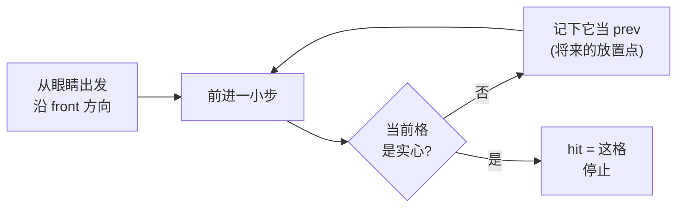

# 08 — 方块选取、破坏与放置

**米雅**

主人，目前为止您是这个世界的「幽灵」——看得见，摸不着。

这一章结束时，您就能左键挖方块、右键放方块，正式**触碰**这个世界喵。

**主人**

问题是……程序怎么知道我「瞄准」的是哪一块？

**米雅**

好问题，这正是本章的核心：**射线投射（raycast）**。

准星永远在屏幕正中，而屏幕正中指向的方向就是相机的 `front()`（复习第 03 章：由 yaw/pitch 算出的朝向向量）。

从眼睛出发、沿这个方向**一小步一小步往前挪**，

每挪一步看看「现在踩进了哪个格子、那格是不是实心」——

第一个撞到的实心格，就是您瞄准的方块。

## 本章动手地图

| 步骤 | 为了…… | 请您现在做 |
|------|--------|------------|
| A | 算出准星打中哪格 | **新建** `src/player/raycast.hpp` |
| B | 每帧更新瞄准目标 | **改** `main.cpp` 主循环：加载区块之后调用 `raycast` |
| C | 左键挖 / 右键放 | 同处读鼠标，**边沿触发**调用 `world.setBlock` |
| D | 挖完自动刷新画面 | 什么都不用做——欣赏第 05 章埋的伏笔开花 |



**主人**

为什么还要记一个 `prev`？

**米雅**

右键放方块时，新方块要放在**被瞄准那格的外侧**——

也就是射线撞进实心格**之前经过的最后一个空气格**。

MC 的「贴着面放方块」就是这么实现的喵。

---

## 1. 为了检测打中谁：新建 raycast.hpp

**新建** `src/player/raycast.hpp`（先建文件夹 `src/player/`）：

```cpp
#pragma once
#include "../world/world.hpp"
#include <glm/glm.hpp>
#include <cmath>

// 从 origin 沿 dir 射出，最远 maxDist。
// 命中返回 true，并填：hit=撞到的实心格，prev=撞之前的最后一个空气格(放置点)。
inline bool raycast(const World& world, glm::vec3 origin, glm::vec3 dir,
                    float maxDist, glm::ivec3& hit, glm::ivec3& prev) {
    dir = glm::normalize(dir);
    glm::ivec3 last = glm::ivec3(glm::floor(origin));  // 起点所在格
    for (float t = 0.f; t < maxDist; t += 0.05f) {     // 每步 5cm
        glm::vec3 p = origin + dir * t;
        glm::ivec3 cell((int)std::floor(p.x), (int)std::floor(p.y), (int)std::floor(p.z));
        if (cell == last) continue;                    // 还在同一格，跳过
        if (world.getBlock(cell.x, cell.y, cell.z) != Block::Air) {
            hit  = cell;
            prev = last;                               // 进入命中格之前那一格
            return true;
        }
        last = cell;
    }
    return false;
}
```

三个细节说人话：

1. **`glm::floor` 而不是强转 int**——复习撕裂妖之战：负坐标下 `(int)-0.5` 是 0 不是 −1，向下取整才正确。
2. **`if (cell == last) continue;`**——步长 5cm，一格 1m，大多数步子还在同一格里打转，跳过省事。
3. **步长 0.05 会漏吗？** 方块边长 1，步子远小于它，正常瞄准不会漏。数学上绝对不漏的版本叫 **DDA 体素遍历**（第 17 章进阶题），入门用这个足够。

---

## 2. 为了每帧知道瞄哪：改 main.cpp

**① 顶部 include**：

```cpp
#include "player/raycast.hpp"
```

**② 主循环里**，紧跟在 `world.updateLoadedChunks(...)` 之后加：

```cpp
//准星射线：找到瞄准的方块(hit)和它前面那格空气(prev)
glm::ivec3 hit{}, prev{};
bool hitOk = raycast(world, gCamera.position, gCamera.front(), 8.f, hit, prev);
```

`8.f` 是可挖距离（原版 MC 约 4.5~5 格，我们大方点）。

---

## 3. 为了挖和放：读鼠标

**紧接着上面**写：

```cpp
//当前帧鼠标状态
bool left  = glfwGetMouseButton(window, GLFW_MOUSE_BUTTON_LEFT)  == GLFW_PRESS;
bool right = glfwGetMouseButton(window, GLFW_MOUSE_BUTTON_RIGHT) == GLFW_PRESS;
//记住上一帧状态，只在「这一帧刚按下」时触发一次（边沿触发）
static bool wasLeft = false, wasRight = false;

if (left && !wasLeft && hitOk)   //左键：挖掉命中格
    world.setBlock(hit.x, hit.y, hit.z, Block::Air);
if (right && !wasRight && hitOk) //右键：在命中面外侧放一块
    world.setBlock(prev.x, prev.y, prev.z, Block::Stone);

wasLeft = left;
wasRight = right;
```

**主人**

「边沿触发」？直接 `if (left) 挖` 不行吗？

**连发妖·嗒嗒嗒** 登场

**连发妖·嗒嗒嗒**

行啊行啊，当然行啊！

来来来，你就写 `if (left) 挖`，然后轻轻点一下鼠标——

**主人**

……怎么样？

**连发妖·嗒嗒嗒**

你的主循环一秒跑几百圈！

你手指按下到抬起，少说 0.1 秒——

这 0.1 秒里循环跑了几十圈，圈圈都看到「左键是按着的」！

嗒嗒嗒嗒嗒嗒——一瞬间挖穿一整条隧道！

从山顶一枪打到岩心，爽不爽？嘻嘻嘻！

**米雅**

所以要记住**上一帧**的状态：

`left && !wasLeft` 的意思是「这一帧按着，上一帧**没**按着」——

也就是**刚按下去的那一瞬间**，整个按住的过程只有一帧满足。

按一次 = 触发一次。这叫**边沿触发**（取「信号从 0 跳到 1 的上升沿」之意）。

**主人**

`static` 又是什么讲究？

**米雅**

写在函数里的 `static` 变量：只初始化一次，**循环转多少圈它都记得上次的值**。

正好拿来存「上一帧的状态」。

（第 14 章重构主循环时它会搬家成普通变量，先这么用。）

**连发妖·嗒嗒嗒**

可恶……被一个 `static bool` 封印了……

不过嘛，将来你做「按住持续挖掘」时还得请我回来——

**米雅**

那时是**故意**连发，和失控连发是两回事。走好不送喵。

**连发妖·嗒嗒嗒** 被击败

---

## 4. 为了挖完真的有洞：什么都不用做

**米雅**

主人还记得第 05 章 `World::setBlock` 里那两步吗？

**主人**

呃……`chunk.set()` 里有 `dirty = true`，然后还调了个 `markNeighborDirty`。

**米雅**

对！当时您问「为什么要多此一举」，我说第 08 章见分晓——就是现在：

1. 挖掉方块 → `set` 把所在 Chunk 标脏 → 绘制循环里 `if (c.dirty) c.rebuildMesh()` → **下一帧洞就出现了**；
2. 若挖的是紧贴区块边界的格子，隔壁 Chunk 朝这边的面本来被挡着没生成——现在露出来了，得跟着重建。`markNeighborDirty` 干的就是这个。没有它，边界上会挖出**看穿世界的空洞**。

伏笔回收，一行都不用写喵。

跑起来试试：对着山坡左键连点几下，挖个楼梯上山；右键在空中搭一条石头栈道。

**主人**

挖树叶的时候……树叶后面的树叶也一层层露出来了，有点治愈。

**米雅**

不过您可能也注意到两件小别扭：

1. 右键放方块时，如果 `prev` 正好是您自己站的位置，方块会「放进您身体里」——因为我们还没有碰撞体积，第 10 章解决；
2. 挖了半天，手里既没有获得方块，也不能选择放什么——**背包**在第 13 章等着。

一步一步来，罗马不是一天挖成的喵。

---

## 概念小抄

| 词 | 人话 |
|----|------|
| raycast | 从眼睛沿视线一小步步走，找第一个实心格 |
| hit / prev | 撞到的实心格 / 它前面那格空气（放置点） |
| 边沿触发 | 「刚按下的那一帧」才算数，防连发 |
| static 局部变量 | 函数内的「长寿变量」，跨帧记状态 |
| DDA | 数学上不漏格的射线遍历（进阶） |

---

## 本章检查点

- [ ] 左键单击只挖**一格**（连发妖没有复活）
- [ ] 右键能贴着瞄准面放石头
- [ ] 专门去区块接缝处挖：邻区正确刷新，没有留下透视空洞
- [ ] 能说清 `hit` 和 `prev` 的区别

**米雅**

下一章我们做两件「一眼就值」的事：

屏幕中央的**十字准星**，和瞄准方块的**黑色描边框**——

顺便学会怎么在 3D 世界上画 2D 的 UI。这可是通往主菜单和背包的必经之路喵。

→ [09-crosshair-and-ui.md](09-crosshair-and-ui.md)
