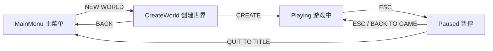

# 14 — 主菜单与游戏状态机

**米雅**

主人，一个尖锐的问题：现在这个程序，算「游戏」吗？

**主人**

呃……双击 exe，直接摔进世界里；按 ESC，整个程序啪地关掉。

……像个技术 demo。

**米雅**

对。「游戏」和「demo」之间隔着的东西叫**门面**：

标题画面、开始按钮、创建世界、暂停菜单。这一章全部补上：

- **主菜单**：泥土背景 + 大标题 + NEW WORLD / QUIT
- **创建世界**：可以**输入种子**（终于不用改代码换世界了喵！）
- **暂停菜单**：ESC 暂停，世界定格，继续 or 退回标题

而撑起这一切的骨架，是个非常重要的编程概念——**状态机**。

## 本章动手地图

| 步骤 | 为了…… | 请您现在做 |
|------|--------|------------|
| A | 程序知道自己「在哪个界面」 | **改** `main.cpp`：`GameState` 枚举 + 全局状态 |
| B | 世界能生能灭 | `World world(2024)` 改成 `unique_ptr` + `startNewWorld` |
| C | 鼠标模式跟着状态走 | 写 `setState` 辅助函数 |
| D | 有按钮可点 | 写 `uiButton`（立即模式 GUI） |
| E | 能输入种子 | 字符回调 `char_callback` + 退格处理 |
| F | 主循环按状态分岔 | 重排 `while` 循环（本章的大手术） |

> 本章只动 `main.cpp` 一个文件，但动得不轻。开工前建议先完整读一遍第 1、2 节再落笔喵。

---

## 1. 先搞懂：状态机（只阅读）

**米雅**

**状态机**说穿了就一句话：

> 程序任何时刻**必须**处于且只处于一个状态；每个状态有自己的画面和输入规则；事件触发状态**跳转**。

我们的四个状态和跳转图：



**主人**

不用状态机会怎么样？

**米雅**

一堆 `bool inMenu; bool paused; bool creating;` 互相打架——

「暂停时又开着背包再按 ESC 会怎样」这类问题会把您逼疯喵。

一个枚举变量，永远只有一个值，逻辑就有了唯一的真相。

顺便还有个新朋友：**立即模式 GUI**。我们的按钮不是「创建一个按钮对象存起来」，

而是每帧调用 `uiButton(...)`——它当场画出按钮、当场告诉你被点没被点。

没有控件树、没有事件系统，对游戏 UI 来说又简单又够用（Dear ImGui 就是这个思想）。

---

## 2. 骨架代码：全局区

以下都在 `main.cpp`。**① include 补三个**：

```cpp
#include <memory>//unique_ptr管世界的生死
#include <string>
#include <ctime>//随机种子用当前时间
```

**② 全局区**（`gCamera` 那一片）加：

```cpp
//游戏在哪个界面？整个程序就是这几个状态之间跳转
enum class GameState {
    MainMenu,    //主菜单
    CreateWorld, //创建世界(输入种子)
    Playing,     //游戏中
    Paused,      //暂停菜单
};

static GameState gState = GameState::MainMenu;//开局在主菜单
static std::unique_ptr<World> gWorld;//世界：进了游戏才存在，退出到标题就销毁
static std::string gSeedInput;//创建世界界面正在输入的种子
```

**主人**

`World` 为什么要从栈上搬进 `unique_ptr`？

**米雅**

以前世界和程序同生共死，声明成局部变量就行。

现在世界的生命周期变了：主菜单时**还没有**世界，

QUIT TO TITLE 时世界要**销毁**，再开新档又要**重建**。

`unique_ptr` 的 `make_unique` / `reset()` 正好对应「出生 / 死亡」，复习第 05 章：它会自动释放，不用手写 delete。

**③ 字符回调**（`mouse_callback` 前面）：

```cpp
//打字回调：创建世界界面输入种子数字用（和按键回调不同，它给的是「字符」）
static void char_callback(GLFWwindow*, unsigned int cp) {
    if (gState == GameState::CreateWorld && cp >= '0' && cp <= '9' && gSeedInput.size() < 9)
        gSeedInput += (char)cp;
}
```

**主人**

`glfwGetKey` 不是能读键盘吗，为什么还要一个回调？

**米雅**

`glfwGetKey` 读的是「**物理键**现在按没按着」，适合 WASD；

打字需要的是「系统认为你输入了**什么字符**」——大小写、输入法、按住重复，都是系统处理好的。

GLFW 把两者分成 key 和 char 两套，打字一律用 char 回调。别忘了在 `main` 里注册：

```cpp
glfwSetCharCallback(window, char_callback);//打字输种子
```

**④ `mouse_callback` 的闸门升级**（原来只看背包）：

```cpp
if (gState != GameState::Playing || gInventoryOpen) return;//只有游戏中才转视角
```

**⑤ 两个辅助函数**（`framebuffer_size_callback` 后面）：

```cpp
//切换游戏状态，顺便把鼠标模式调对：游戏中锁定，其它界面放开
static void setState(GLFWwindow* window, GameState s) {
    gState = s;
    bool grab = (s == GameState::Playing) && !gInventoryOpen;
    glfwSetInputMode(window, GLFW_CURSOR, grab ? GLFW_CURSOR_DISABLED : GLFW_CURSOR_NORMAL);
    if (grab) firstMouse = true;//回到游戏时重置，防视角猛跳
}

//开一个新世界：建World、把玩家放到出生点地面上
static void startNewWorld(uint32_t seed) {
    gWorld = std::make_unique<World>(seed);
    gPlayer = Player{};//重置玩家(位置速度全归零)
    int h = heightAt(gWorld->noise, 8, 8);
    gPlayer.pos = { 8.5f, (float)(h + 1), 8.5f };//直接站在出生点地面上
    gInventoryOpen = false;
}
```

**米雅**

看 `startNewWorld` 的最后一手：用 `heightAt` 先**问地形**「(8,8) 这列地面多高」，

把玩家直接放在草地上——第 10 章穿墙妖预言的「出生瞬间陷进未生成地形」就此根治。

`setState` 则是治「光标模式乱套」的：**所有**状态切换都必须走它，

鼠标该锁该放就永远不会错。谁绕开它直接改 `gState`，谁负责修 bug 喵。

**⑥ 按钮函数**（`startNewWorld` 后面）：

```cpp
//画一个按钮，返回这一帧它是否被点击
static bool uiButton(UIRenderer& ui, Font& font, float x, float y, float w, float h,
                     const std::string& label, float mfx, float mfy, bool click) {
    bool hover = mfx >= x && mfx < x + w && mfy >= y && mfy < y + h;
    ui.rect(x, y, w, h, hover ? glm::vec4{0.6f,0.6f,0.6f,0.95f} : glm::vec4{0.35f,0.35f,0.35f,0.9f});
    ui.rect(x + 2, y + 2, w - 4, h - 4,
            hover ? glm::vec4{0.32f,0.32f,0.32f,0.95f} : glm::vec4{0.18f,0.18f,0.18f,0.9f});
    font.draw(ui, x + w * 0.5f - Font::measure(18, label) * 0.5f, y + h * 0.5f - 9, 18, label);
    return hover && click;
}
```

全是熟面孔：边框 = 叠矩形（13 章）、文字居中 = measure（12 章）、hover = 四个比较（13 章）。新东西只有「把它们装进一个函数、当场返回点击结果」——这就是立即模式 GUI 的全部喵。

---

## 3. 大手术：重排主循环

现在改 `while` 循环。原则先说清，主人再动刀：

> **循环开头**：算 dt、屏幕尺寸、**鼠标状态**（位置换算 + click 边沿）、ESC 处理、清屏——这些每个状态都要用。
> **然后一个大分岔**：`Playing/Paused` 走游戏分支，`MainMenu/CreateWorld` 走菜单分支。

### 3.1 循环开头（公共部分）

原来散在循环各处的这些，**集中搬**到循环最前面：dt 计算、`fbw/fbh/aspect`。再加上新的公共鼠标处理（第 13 章背包里那段换算**升级搬家**到这里，因为现在菜单也要用）：

```cpp
float cx = fbw * 0.5f, cy = fbh * 0.5f;

//鼠标状态整个UI共用：位置换算成帧缓冲坐标(防高DPI错位)，点击取边沿
bool left  = glfwGetMouseButton(window, GLFW_MOUSE_BUTTON_LEFT)  == GLFW_PRESS;
bool right = glfwGetMouseButton(window, GLFW_MOUSE_BUTTON_RIGHT) == GLFW_PRESS;
static bool wasLeft = false, wasRight = false;
bool click = left && !wasLeft;
double mx, my;
glfwGetCursorPos(window, &mx, &my);
int winW, winH;
glfwGetWindowSize(window, &winW, &winH);
float mfx = (float)mx * fbw / (winW ? winW : 1);
float mfy = (float)my * fbh / (winH ? winH : 1);
```

ESC 的老代码（按了就关窗）**删掉**，换成状态机版：

```cpp
//ESC按状态各有含义：游戏中→暂停(先关背包)，暂停→回游戏
bool escNow = glfwGetKey(window, GLFW_KEY_ESCAPE) == GLFW_PRESS;
static bool escWas = false;
if (escNow && !escWas) {
    if (gState == GameState::Playing) {
        if (gInventoryOpen) {
            gInventoryOpen = false;
            setState(window, GameState::Playing);//重设鼠标锁定
        } else {
            setState(window, GameState::Paused);
        }
    } else if (gState == GameState::Paused) {
        setState(window, GameState::Playing);
    }
}
escWas = escNow;
```

（注意 ESC 也吃了边沿触发——不然按一下 ESC 会在暂停/继续之间每帧横跳，连发妖阴魂不散喵。）

### 3.2 游戏分支：把现有代码包进去

清屏之后，开大分岔。**把从「WASD 输入」到「ui.end()」的全部现有代码**包进：

```cpp
if (gState == GameState::Playing || gState == GameState::Paused) {
    World& world = *gWorld;//这两个状态下世界一定存在
    ...
}
else {
    ...菜单分支（3.3节）...
}
```

包进去之后，在**里面**做这些调整：

1. `World world(2024);` 那行（循环外的）**删掉**——世界现在由 `startNewWorld` 创建。分支开头的 `World& world = *gWorld;` 让后面所有 `world.xxx` 代码**原样能用**，一行不用改；
2. **输入+物理整段**（WASD → `updateLoadedChunks` → raycast → 挖放）再包一层 `if (gState == GameState::Playing) { ... }`——暂停时世界**冻结**：不走、不掉、不挖。`hit/prev/hitOk` 的声明提到这层 if 外面（描边框还要用）：

```cpp
glm::ivec3 hit{}, prev{};
bool hitOk = false;
if (gState == GameState::Playing) {
    //……现有的输入、物理、raycast、挖放……
    hitOk = raycast(world, gCamera.position, gCamera.front(), 8.f, hit, prev);
    //……
}
```

3. E 键开背包处，原来手动调 `glfwSetInputMode` 的两行换成一句 `setState(window, GameState::Playing);`（setState 会按 `gInventoryOpen` 算出正确的鼠标模式）；
4. 挖放和背包点击原来自己算的鼠标坐标换算**删掉**，直接用循环开头的 `mfx/mfy/click`；
5. 准星的显示条件改成 `gState == GameState::Playing && !gInventoryOpen`；
6. 世界渲染（两遍绘制）**不包** Playing 判断——暂停时画面要定格在背后当背景。

然后在游戏内 UI 的最后（调试信息之前）加**暂停菜单**：

```cpp
//暂停菜单
if (gState == GameState::Paused) {
    ui.rect(0, 0, (float)fbw, (float)fbh, { 0,0,0,0.6f });//压暗世界
    std::string t = "GAME PAUSED";
    font.draw(ui, cx - Font::measure(28, t) * 0.5f, cy - 120, 28, t);

    if (uiButton(ui, font, cx - 150, cy - 40, 300, 44, "BACK TO GAME", mfx, mfy, click))
        setState(window, GameState::Playing);
    if (uiButton(ui, font, cx - 150, cy + 20, 300, 44, "QUIT TO TITLE", mfx, mfy, click)) {
        gWorld.reset();//世界销毁(还没有存档，下一章救它)
        setState(window, GameState::MainMenu);
    }
}
```

### 3.3 菜单分支

`else` 里是全新内容——纯 UI，反而轻松：

```cpp
else {
    //———— 菜单界面（主菜单/创建世界）————
    ui.begin(fbw, fbh);

    //泥土平铺背景，MC主菜单的经典味道
    float u0, v0, u1, v1;
    tileUV(T_DIRT, u0, v0, u1, v1);
    for (float ty = 0; ty < fbh; ty += 64)
        for (float tx = 0; tx < fbw; tx += 64)
            ui.texRect(tx, ty, 64, 64, atlas, u0, v0, u1, v1, { 0.4f,0.4f,0.4f,1.f });

    if (gState == GameState::MainMenu) {
        std::string title = "OPENGLMC";
        font.draw(ui, cx - Font::measure(48, title) * 0.5f, cy - 170, 48, title);
        std::string sub = "a hand-made minecraft";
        font.draw(ui, cx - Font::measure(16, sub) * 0.5f, cy - 110, 16, sub, { 0.8f,0.8f,0.8f,1.f });

        if (uiButton(ui, font, cx - 150, cy - 30, 300, 44, "NEW WORLD", mfx, mfy, click)) {
            gSeedInput.clear();
            setState(window, GameState::CreateWorld);
        }
        if (uiButton(ui, font, cx - 150, cy + 30, 300, 44, "QUIT", mfx, mfy, click))
            glfwSetWindowShouldClose(window, true);
    }
    else if (gState == GameState::CreateWorld) {
        std::string title = "CREATE NEW WORLD";
        font.draw(ui, cx - Font::measure(28, title) * 0.5f, cy - 150, 28, title);

        //种子输入框（就是一个矩形+一行字，没输入时显示提示）
        font.draw(ui, cx - 150, cy - 80, 16, "SEED (numbers, empty = random):");
        ui.rect(cx - 150, cy - 55, 300, 36, { 0,0,0,0.7f });
        ui.rect(cx - 148, cy - 53, 296, 32, { 0.1f,0.1f,0.1f,0.9f });
        if (gSeedInput.empty())
            font.draw(ui, cx - 140, cy - 47, 18, "(random)", { 0.5f,0.5f,0.5f,1.f });
        else
            font.draw(ui, cx - 140, cy - 47, 18, gSeedInput);

        //退格删种子（边沿触发）
        bool bsNow = glfwGetKey(window, GLFW_KEY_BACKSPACE) == GLFW_PRESS;
        static bool bsWas = false;
        if (bsNow && !bsWas && !gSeedInput.empty()) gSeedInput.pop_back();
        bsWas = bsNow;

        if (uiButton(ui, font, cx - 150, cy + 10, 300, 44, "CREATE", mfx, mfy, click)) {
            uint32_t seed = gSeedInput.empty()
                ? (uint32_t)time(nullptr)               //没输就用当前时间当种子
                : (uint32_t)std::stoul(gSeedInput);
            startNewWorld(seed);
            setState(window, GameState::Playing);
        }
        if (uiButton(ui, font, cx - 150, cy + 70, 300, 44, "BACK", mfx, mfy, click))
            setState(window, GameState::MainMenu);
    }
    ui.end();
}
```

最后三件收尾：

1. 分岔结束后（`ui.end()` 都跑完），循环末尾统一 `wasLeft = left; wasRight = right;`（原第 13 章位置不变）；
2. `main` 初始化里，原来的 `glfwSetInputMode(window, GLFW_CURSOR, GLFW_CURSOR_DISABLED);` **删掉**，换成初始化末尾（进主循环前）的一句 `setState(window, GameState::MainMenu);`——开局是菜单，鼠标该是指针；
3. 「输入框」的真相主人也看到了：**一个矩形加一行字而已**。焦点、光标闪烁、选中高亮……那些是操作系统输入框的富贵病，游戏里一个种子框用不上喵。

构建运行！泥土背景的标题画面 → NEW WORLD → 输入 `12345` → CREATE → 站在草地上。ESC 暂停，世界在背后定格。QUIT TO TITLE 回标题，再 CREATE 一个不同种子——完全不同的世界。

**主人**

它终于……长得像一个游戏了。

**米雅**

而且主人应该发现了：这一整章**没有一只新妖怪**。

因为所有零件——按钮是矩形+文字+hover，输入框是矩形+字符串，

状态切换是枚举赋值——全是打败过的怪掉落的装备。

到了这个阶段，新功能只是旧知识的排列组合，这就是「学会了」的感觉喵。

（唯一的坑记一下：QUIT TO TITLE 之后世界就**没了**，方块白挖了。下一章：存档。）

---

## 概念小抄

| 词 | 人话 |
|----|------|
| 状态机 | 一个枚举说了算：在哪个界面、听谁的输入 |
| 立即模式 GUI | 按钮不是对象，是每帧画+当场判点击的函数 |
| key vs char 回调 | 物理按键 vs 系统翻译好的字符；打字用后者 |
| unique_ptr 的生死 | `make_unique` 出生，`reset()` 死亡 |
| 世界冻结 | 暂停 = 跳过输入和物理，照常渲染 |

---

## 本章检查点

- [ ] 开局是主菜单，鼠标是普通指针
- [ ] 输入种子 `12345` 两次创建的世界一模一样；空种子每次随机
- [ ] 出生直接站在草地上（不再从天上摔）
- [ ] 游戏中 ESC → 暂停（世界定格）；再 ESC → 回游戏且视角不跳
- [ ] 开着背包按 ESC：只关背包，不进暂停
- [ ] QUIT TO TITLE → NEW WORLD 能反复横跳不崩溃

**米雅**

现在最痛的事：辛辛苦苦盖的房子，退出就灰飞烟灭。

下一章把世界**写进硬盘**——存档与读档喵。→ [15-save-and-load.md](15-save-and-load.md)
